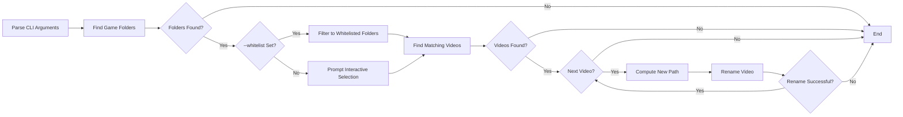
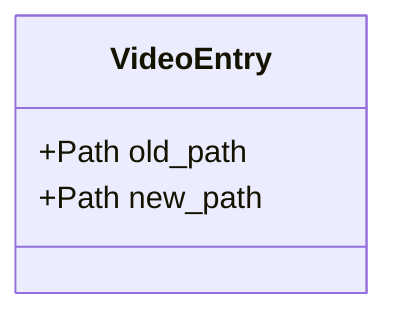
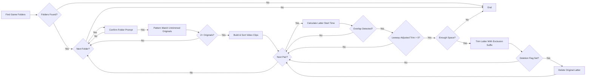
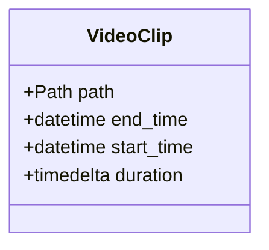

# rename_obs_videos.py

## Pipeline approach

## Data structure

I initially leaned toward a plan-apply approach that provided a full plan with a saved JSON file where the user could receive a confirmation prompt before executing renames and that plan would be left as a log or instructions for a future rollback implementation. However, a pipeline approach dropping the JSON file was chosen because having all inputs able to be committed upfront via CLI arguments better fits real workflows, individual renames are atomic filesystem operations leaving no complex partial state, a .log file provides a sufficient audit trail, and how rare rollbacks for this use case would be in practice.

# trim_overlapping_videos.py

## Pipeline approach

## Data structure

Besides general advantages like speed optimization and avoiding plans that can become stale, I chose a pipeline approach because rollback is not possible with file deletion and excluding trimmed files with the output suffix (and their originals) from pattern matching is our idempotent guarantee. There would still be a TOC/TOU issue when checking for available space while running each subdirectory in parallel, so we'll use sequential execution by default for now. There is also room for greedy lookahead optimization in the future with videos that are fully overlapped by a preceding and succeeding video. I also thought we could potentially utilize the fact that successive replays likely have the same duration set in OBS but I found out that the resulting duration can be off target by up to around 3 seconds.

I dropped the `--whitelist`/numbered-selection flow from the renamer in favor of a per-folder `[y/N]` confirmation prompt. Non-interactive automation makes sense for a reversible rename, but this script permanently deletes footage when `--delete-originals` is set, so a confirmation gate right before each folder is touched fits the risk better than an upfront CLI flag. `--delete-originals` still defaults to off. A `TRIM_LEEWAY_SECONDS` constant (0.5s) is subtracted from the detected overlap before trimming, so a small buffer of duplicate frames is deliberately left at the start of the latter clip instead of cutting exactly on the boundary so editors have room to stitch clips together without dropped frames. Clips are sorted by their parsed timestamp rather than filename string, since a folder can mix already-renamed and not yet renamed files whose prefixes don't sort chronologically together.